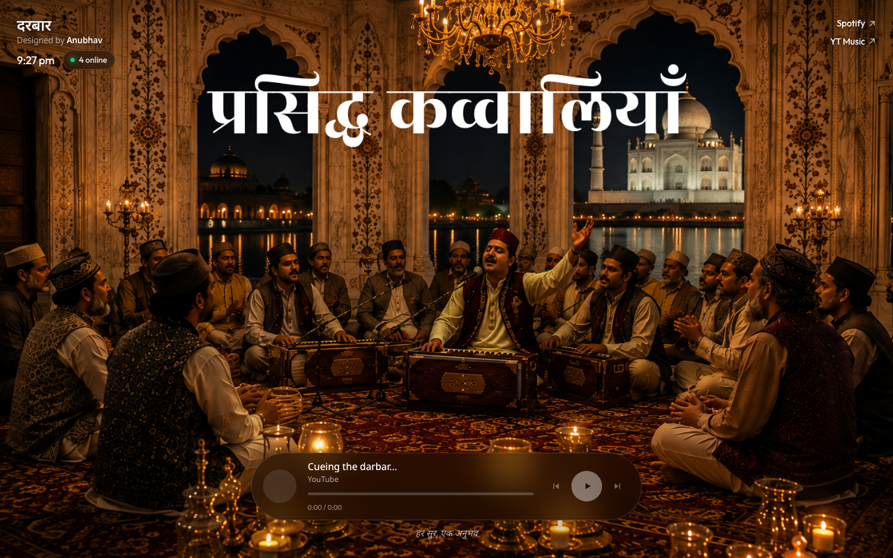
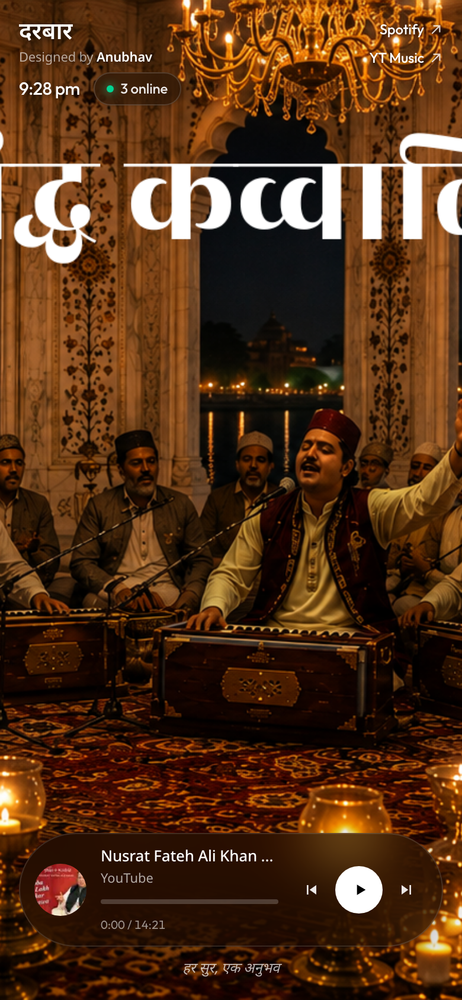

# दरबार · Darbar

A full-screen qawwali room. YouTube plays the audio. Your artwork stays the hero.

**Live:** [darbar-anubhav.vercel.app](https://darbar-anubhav.vercel.app)



<p align="center">
  
</p>

## Run locally

```bash
npm install
npm run dev
```

Open [http://localhost:3000](http://localhost:3000).

## What's inside

- **Hidden YouTube player** streams the audio; the background scene stays the hero.
- **Pinned opening track** — a chosen video always plays first, then the room rolls
  into the playlist (shuffled + looped). Prev/next step across that boundary.
- **Live now-playing** bar with thumbnail, title, scrubbable progress, and
  prev / play / next.
- **Presence** — an approximate "N online" count.
- **Responsive** — safe-area aware for notched phones; tuned for touch.

## Configure the scene / playlist

| What | Where |
| --- | --- |
| Background | Replace `public/bg.png` (wide 16:9 works best) |
| YouTube playlist | `NEXT_PUBLIC_YT_PLAYLIST_ID` or `lib/site.ts` |
| Opening track | `NEXT_PUBLIC_YT_FIRST_VIDEO_ID` or `lib/site.ts` |
| Spotify / YT Music links | same env vars or `lib/site.ts` |

Copy `.env.example` → `.env.local` to override without editing code.

## Deploy on Vercel

1. Push this repo to GitHub
2. Import the project on [vercel.com/new](https://vercel.com/new)
3. Add the same env vars in the Vercel dashboard if you want a different playlist
4. Deploy

Music is streamed by YouTube's player (iframe is hidden). Do not host MP3s. Do not
monetize the page off the tracks.

The online count is approximate on serverless (per instance). Fine for a small room.

---

Designed by **Anubhav** · *हर सुर, एक अनुभव*
